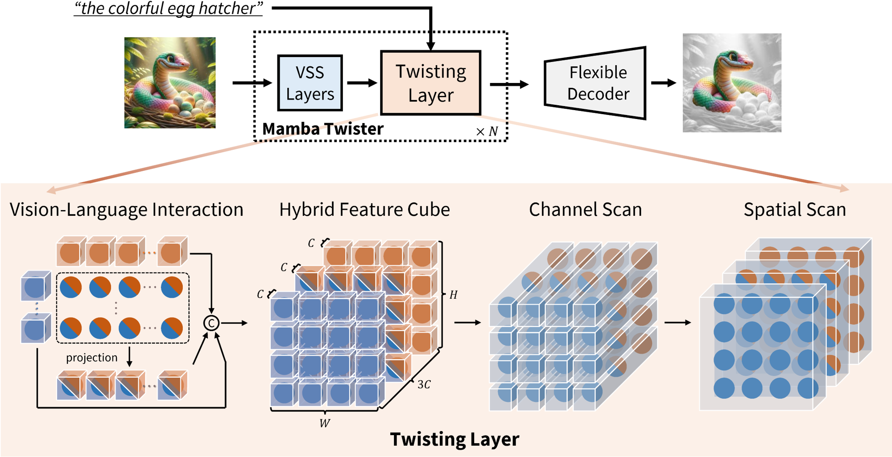

<div align="center">
<h1>ReMamber </h1>
<h3>ReMamber: Referring Image Segmentation with Mamba Twister</h3>

Yuhuan Yang*<sup>1</sup>, Chaofan Ma*<sup>1</sup>, Jiangchao Yao<sup>1</sup>, Zhun Zhong<sup>2</sup>, Ya Zhang<sup>1</sup>, Yanfeng Wang<sup>1</sup>

<sup>1</sup>  Shanghai Jiao Tong University, <sup>2</sup>  University of Nottingham

ECCV 2024 Paper: ([arXiv 2403.17839](https://arxiv.org/abs/2403.17839))

<div align="left">

## Abstract
Referring Image Segmentation (RIS) leveraging transformers has achieved great success on the interpretation of complex visual-language tasks. However, the quadratic computation cost makes it resource-consuming in capturing long-range visual-language dependencies. Fortunately, Mamba addresses this with efficient linear complexity in processing. However, directly applying Mamba to multi-modal interactions presents challenges, primarily due to inadequate channel interactions for the effective fusion of multi-modal data. In this paper, we propose **ReMamber**, a novel RIS architecture that integrates the power of Mamba with a multi-modal Mamba Twister block. The Mamba Twister explicitly models image-text interaction, and fuses textual and visual features through its unique channel and spatial twisting mechanism. We achieve the state-of-the-art on three challenging benchmarks. Moreover, we conduct thorough analyses of **ReMamber** and discuss other fusion designs using Mamba. These provide valuable perspectives for future research.

## Overview
<p align="center">
  
</p>

## Preparation
#### Prepare environment
- python 3.10.13: 
  - ``conda create -n remamber python=3.10.13``
- torch 2.1.1 + cu118: 
  - ``pip install torch==2.1.1 torchvision==0.16.1 torchaudio==2.1.1 --index-url https://download.pytorch.org/whl/cu118``
- install dependencies:
  - ``pip install -r requirements.txt``
- build kernel for VMamba dependencies: 
  - ``cd selective_scan && pip install .``
- pretrain checkpoint
  - download from [link](https://drive.google.com/file/d/1O9P6XLuWtUxFa70vwrYCRVedRAFutczV/view?usp=sharing) (This is the VMamba checkpoint pretrained on ImageNet. We re-upload it since the original VMamba link has broken.)
  - Create a ``pretrain/`` folder and place the checkpoint in it

#### Prepare dataset
Follow [ref_dataset/prepare_dataset.md](ref_dataset/prepare_dataset.md) to prepare dataset.

## Training & Evaluation
This implementation only supports multi-gpu, DistributedDataParallel training. To train ReMamber using 8 GPUs, run:
``` bash
python -m torch.distributed.launch --nproc_per_node=8 \
                                   --use_env main.py \
                                   --model ReMamber_Conv \
                                   --output_dir your/logging/directory \
                                   --if_amp \
                                   --batch_size 8 \
                                   --model-ema
```
And to evaluate on a checkpoint, run:
``` bash
python -m torch.distributed.launch --nproc_per_node=1 \
                                   --use_env main.py \
                                   --model ReMamber_Conv \
                                   --if_amp \
                                   --eval \
                                   --resume your/checkpoint.pth
```

Beyond the convolution-based segmentation head, we also provide a Mamba-based head varient. Use the option ``--model ReMamber_Mamba`` to switch to this architecture.
This architecture is slightly faster and achieves better performance than original convolution-based segmentation head.

## Demo
Try our demo here: [demo.ipynb](demo.ipynb)

Our best checkpoint can be downloaded from [here](https://drive.google.com/file/d/1CqkBL5Dqm4X3ZgPFfO026l9liCAbeEiD/view?usp=sharing) (ReMamber_Mamba) or [here](https://drive.google.com/file/d/1QeS_iq1i4VaTE3nqbUVgsbNwgKllDQRQ/view?usp=sharing) (ReMamber_Conv). Note that these two checkpoints are trained on the mixed three (RefCOCO, RefCOCO+, G-Ref) datasets.

## Citation
If this code is useful for your research, please consider citing:
```
@article{yang2024remamber,
  title   = {ReMamber: Referring Image Segmentation with Mamba Twister},
  author  = {Yuhuan Yang and Chaofan Ma and Jiangchao Yao and Zhun Zhong and Ya Zhang and Yanfeng Wang},
  year    = {2024},
  journal = {European Conference on Computer Vision (ECCV)}
}
```
## Acknowledgements
This project is based on [VMamba](https://github.com/MzeroMiko/VMamba), [Vim](https://github.com/hustvl/Vim), [LAVT](https://github.com/yz93/LAVT-RIS). Thanks for their wonderful works.